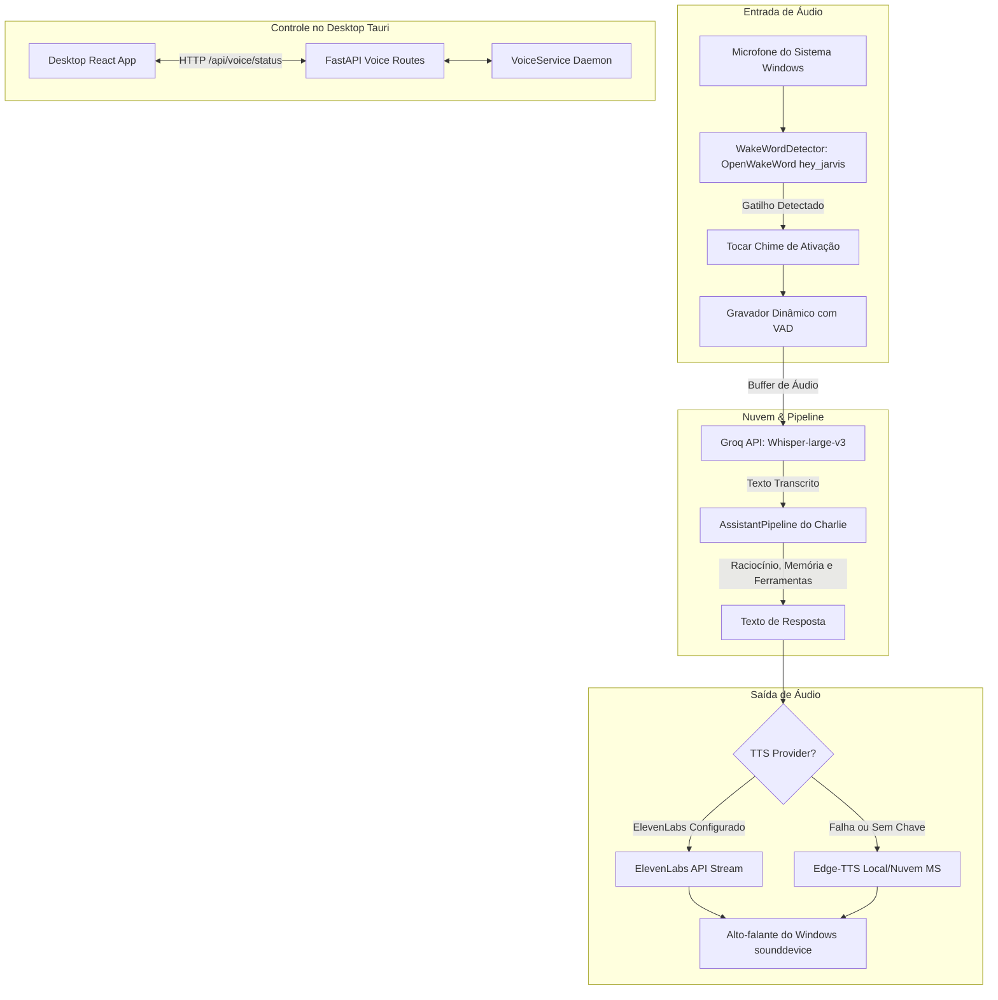

# Especificação de Design: Pipeline de Voz Charlie (ElevenLabs TTS, Groq STT e Wake Word)

- **Data:** 2026-10-07
- **Autor:** Antigravity & Lucas
- **Status:** Aprovado / Em Planejamento
- **Módulos Afetados:** `audio/`, `core/`, `api/routes/`, `desktop/`, `config.py`

---

## 1. Visão Geral e Objetivos

O objetivo deste projeto é reativar e modernizar o ecossistema de voz do Charlie, permitindo interação natural viva-voz no Windows com:
1. **Síntese de Voz de Alta Fidelidade (TTS):** Integração com **ElevenLabs** com suporte a streaming de áudio e fallback resiliente e transparente para **Edge-TTS** caso a cota acabe ou ocorra falha de rede.
2. **Transcrição de Ultra-Baixa Latência (STT):** Uso do **Groq Whisper** (`whisper-large-v3` ou `whisper-large-v3-turbo`) com latência de resposta em torno de 200–300ms e corte inteligente de silêncio (VAD).
3. **Detecção Contínua de Palavra de Ativação (Wake Word):** Monitoramento contínuo em segundo plano usando **OpenWakeWord** com o modelo `hey_jarvis`, consumindo menos de 2% de CPU em standby.
4. **Voice Service Desacoplado & Sincronização com o Desktop:** Gerenciamento do ciclo de vida da escuta via daemon dedicado (`audio/service.py`) e rotas na API FastAPI (`api/routes/voice.py`), permitindo controle pelo app Desktop (Tauri/React) e feedback sonoro (*chime* de ativação) e visual.

---

## 2. Arquitetura do Sistema

---

## 3. Especificação dos Componentes

### 3.1. Text-to-Speech (`audio/tts/tts.py`)
- **Provedores Suportados:**
  - `elevenlabs`: Utiliza a API REST do ElevenLabs (`POST https://api.elevenlabs.io/v1/text-to-speech/{voice_id}/stream`) enviando cabeçalho `xi-api-key`.
  - `edge`: Utiliza a biblioteca `edge-tts` com voz `pt-BR-FranciscaNeural` ou configurada.
- **Fluxo de Síntese:**
  - Método `speak(text: str)`:
    1. Higieniza o texto (remove marcações markdown pesadas, URLs ou blocos de código brutos para fala fluida).
    2. Se `config.tts_provider == "elevenlabs"` e `config.elevenlabs_api_key`:
       - Dispara streaming de chunks de áudio em formato MP3/WAV.
       - Decodifica e reproduz via `sounddevice` e `soundfile`.
    3. Caso o ElevenLabs retorne HTTP 401, 429 (quota excedida) ou timeout:
       - Loga aviso: `Falha na ElevenLabs (status). Chaveando automaticamente para Edge-TTS fallback.`
       - Sintetiza via `edge_tts.Communicate` e reproduz sem que o usuário note interrupção.
- **Configurações adicionadas a `config.py`:**
  - `elevenlabs_api_key: str = os.getenv("ELEVENLABS_API_KEY", "")`
  - `elevenlabs_voice_id: str = os.getenv("ELEVENLABS_VOICE_ID", "")`
  - `elevenlabs_model_id: str = os.getenv("ELEVENLABS_MODEL_ID", "eleven_multilingual_v2")`

### 3.2. Speech-to-Text (`audio/stt/stt.py`)
- **Gravação Dinâmica:**
  - Captura a 16.000 Hz, 1 canal (mono), float32.
  - VAD baseado em RMS com limiar `stt_silence_threshold` (padrão 0.015) e janela de silêncio para encerramento de fala calibrada para 1.0 segundo.
  - Limite máximo de captura: 30 segundos.
- **Transcrição via Groq:**
  - Converte o buffer de áudio em memória para formato WAV ou MP3 (sem necessidade de arquivo físico permanente no disco).
  - Envia para `client.audio.transcriptions.create(model="whisper-large-v3", file=audio_bytes, language="pt", prompt="Charlie, assistente inteligente.")`.
  - Fallback: se `groq_api_key` não estiver configurada, tenta `faster-whisper` local.

### 3.3. Wake Word (`audio/wakeword/wakeword.py`)
- **Motor:** `openwakeword`.
- **Modelo:** `hey_jarvis` (pré-treinado internamente no pacote, sem necessidade de treinamento de rede neural).
- **Parâmetros:**
  - Buffer de leitura de 1280 amostras a 16kHz.
  - Limiar de ativação: 0.5 (configurável).
  - Ao detectar a palavra:
    - Reseta o estado interno do modelo.
    - Executa som curto de *chime* de ativação (sintetizado via onda senoidal gerada matematicamente pelo `numpy` ou arquivo `assets/chime.wav`).

### 3.4. Orquestrador de Serviço (`audio/service.py`)
- Classe `VoiceService`:
  - Atributos: `is_running: bool`, `current_state: VoiceState` (`IDLE`, `LISTENING`, `THINKING`, `SPEAKING`, `STOPPED`).
  - Método `start()`: Inicia a thread de escuta assíncrona em background.
  - Método `stop()`: Para o loop de escuta e desocupa o microfone.
  - Loop Principal:
    1. Aguarda Wake Word em standby.
    2. Altera estado para `LISTENING` e emite o chime sonoro.
    3. Ativa *ducking* de áudio do Windows (reduz mídia de fundo).
    4. Grava fala do usuário via STT e obtém texto.
    5. Se texto for vazio, retorna a `IDLE`.
    6. Altera estado para `THINKING` e processa no `AssistantPipeline`.
    7. Altera estado para `SPEAKING` e reproduz resposta via TTS.
    8. Restaura *ducking* de áudio e volta a `IDLE`.

### 3.5. Endpoints da API (`api/routes/voice.py`)
- `GET /api/voice/status`: Retorna `{ "running": bool, "state": str, "provider": str, "wake_word": str }`.
- `POST /api/voice/toggle`: Inicia ou encerra a escuta em background. Payload: `{ "enabled": bool }`.
- `POST /api/voice/speak`: Sintetiza um texto sob demanda via TTS. Payload: `{ "text": str }`.
- `POST /api/voice/test`: Testa a voz configurada da ElevenLabs tocando uma mensagem de amostra.

### 3.6. Interface Desktop (`desktop/src/components/SettingsModal.tsx`)
- Na aba "Voz & Fala":
  - Switch: "Ativação por Voz (Hey Jarvis)".
  - Dropdown Provedor TTS: `ElevenLabs` vs `Edge-TTS`.
  - Input: `ElevenLabs API Key` (com máscara e toggle de visualização).
  - Input: `Voice ID`.
  - Botão "Testar Voz": Dispara chamada a `/api/voice/test` e exibe notificação toast de sucesso/erro.

---

## 4. Plano de Testes e Validação

1. **Teste Unitário do TTS ElevenLabs:**
   - Teste de síntese com chave válida.
   - Teste de fallback para Edge-TTS quando a chave for inválida ou mockar erro HTTP 429.
2. **Teste do Groq STT:**
   - Teste de envio de buffer de áudio sintético para a API Groq e validação de retorno textual.
3. **Teste do Wake Word:**
   - Validação do carregamento do modelo ONNX `hey_jarvis` sem erros de importação.
4. **Teste E2E do VoiceService:**
   - Validação das transições de estado (`IDLE` -> `LISTENING` -> `THINKING` -> `SPEAKING` -> `IDLE`).
5. **Teste dos Endpoints da API:**
   - Validação de `/api/voice/status`, `/api/voice/toggle` e `/api/voice/speak`.
